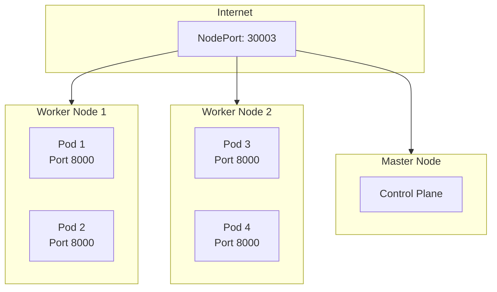
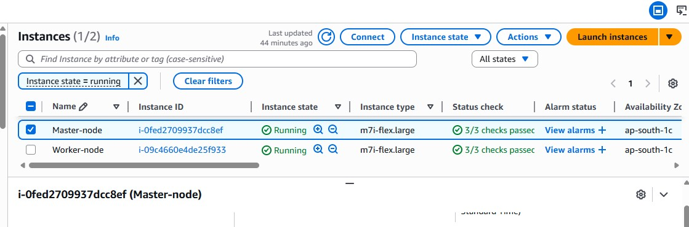
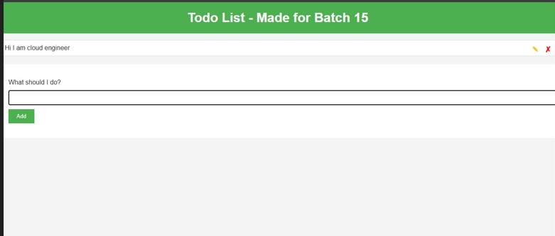

#  Kubernetes Node.js Application Deployment


## 📋 Project Overview

This project demonstrates deploying a Node.js application on Kubernetes cluster running on AWS EC2 instances. The infrastructure consists of master and worker nodes with various Kubernetes manifests for pods, replica sets, deployments, and services.

---

## 🏗️ Architecture Diagram


---

## 🖥️ AWS EC2 Instances

<div align="center">
  
  <p><em>Figure 1: AWS EC2 Console showing Kubernetes cluster nodes</em></p>
</div>

### EC2 Instance Details

| Instance Name | Instance ID | State | Instance Type | Status |
|--------------|-------------|-------|---------------|--------|
| **Master-node** | `i-0fed2709937dcc8ef` | **Running** | `m7i-flex.large` | ✅ Active |
| **Worker-node** | `i-09c4660e4de25f933` | **Running** | `m7i-flex.large` | ✅ Active |

> **Note:** Both instances are running with `m7i-flex.large` type, providing optimal performance for the Kubernetes cluster.

---

## 🌐 Application Web Interface

<div align="center">
  
  <p><em>Figure 2: Todo List Application  </em></p>
</div>

The application is a simple **Todo List** with the message:
- "Hi I am cloud engineer"
- "What should I do?" input field
- "Add" button for adding tasks

---

🚀 Deployment Commands
bash
# Create namespace
kubectl create namespace node-app

# Apply configurations
kubectl apply -f pod.yml

kubectl apply -f replica-sets.yml

kubectl apply -f deployment.yml

kubectl apply -f service.yml

# Verify deployments
kubectl get pods -n node-app

kubectl get replicaset -n node-app

kubectl get deployment -n node-app

kubectl get services -n node-app

# Access application

# http://<node-ip>:30003

---
## 📦 Kubernetes Manifests

### 1️⃣ Pod Configuration (`pod.yml`)

```yaml
apiVersion: v1
kind: Pod
metadata:
  name: node-pod
spec:
  containers:
    - name: node-container
      image: junaidtyagi/nodo-todo-app
      ports:
        - containerPort: 8000
